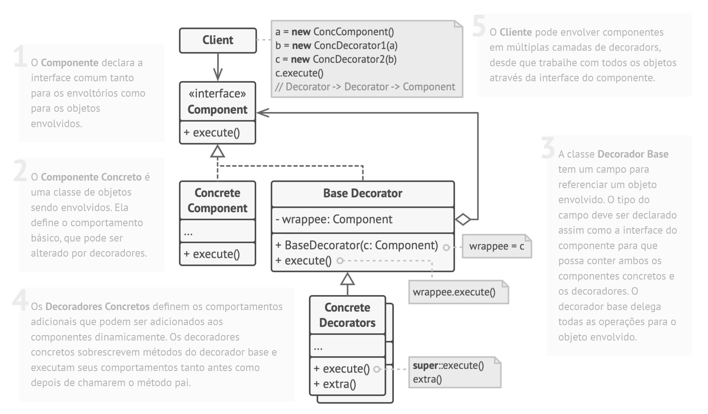

# 🟣 Kotlin Design Patterns: **Simplificando as Soluções Tradicionais**

> Você já se sentiu preso na complexidade dos padrões de design tradicionais enquanto codificava?  
> **Você não está sozinho!**

---

## 👋 Proposta

Vamos explorar juntos como o **Kotlin** pode simplificar (ou até eliminar) a necessidade de muitos padrões clássicos de design, tornando o desenvolvimento mais fluido, expressivo e menos sobrecarregado por código acidental.

---

## 🧩 Por que falar de padrões de design?

Padrões de design são como **soluções reutilizáveis** para problemas recorrentes no desenvolvimento de software:

- Tornam o código **mais fácil de manter e comunicar** 🧠
- Evitam a reinvenção da roda 🛞

> **Mas... em linguagens tradicionais, muitas dessas soluções viram verdadeiros monstros de boilerplate!**

    
     
    <i>Estrutura do Decorator Pattern. Fonte: https://refactoring.guru/pt-br/design-patterns/decorator </i>

---

## 🚀 O que muda com Kotlin?

Kotlin traz recursos modernos que permitem:

- **Menos código**
- **Mais expressividade**
- **Menos chance de errar**
- **Foco no que importa: lógica de negócio, experiência do desenvolvedor**

## 📚 Padrões abordados

- 🟪 **Singleton**
- 🟪 **Builder**
- 🟪 **Proxy**
- 🟪 **Decorator**
- 🟪 **Outros** disponíveis em https://fugisawa.com.

---

## Lucas Fugisawa
- Artigos, E-book, Newsletter, 1-1: **[fugisawa.com](https://fugisawa.com)**
- Comunidade **Kotlin Devs Brasil**: **[kotlinbr.dev](https://kotlinbr.dev)**
- LinkedIn: **[lucasfugisawa](https://www.linkedin.com/in/lucasfugisawa/)**

### E-book + Sorteio de uma licença de 1 ano para qualquer IDE da JetBrains:

   
    
   Obrigado!

